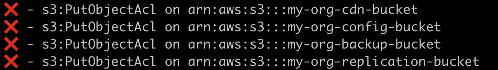

# kubectl-irsa

This kubectl plugin allows us to test abilities of IAM policies which is assigned to the serviceAccount roles via AWS IAM Policy simulator service.

## How to use ?

First step you have to create a simple resource and action map YAML file like this;

This yaml file contains resource list and related actions which would be possibly using by the serviceaccounts roles.

<b>Notice:</b> Each action simulates by the client on individual resources

```yaml
resources:
  - arn:aws:s3:::my-org-cdn-bucket
actions:
  - s3:DeleteBucket

```

After you create this yaml file you are able to use this like this

```sh
  $ kubectl irsa --config config.yaml --sa application-service-account --namespace development
```

## Example outputs;

</img>

## Flags

| flag | Description |
| --- | ----------- |
| role | Name of the role which assumed by service account which is assigned into the annotations of `eks.amazonaws.com/role-arn`  |
| config | Resource map configuration file |

## Setup 

This is a simple pip3 package so if you want to install this plugin on your cluster you just need to run this command like this;

```sh
    git clone git@github.com:WoodProgrammer/kubectl-irsa.git

    pip3 install . --upgrade
```

## Respect To 

### Bir Gün Sabah Sabah-Bir Turgut Uyar

<br>

[](https://www.youtube.com/watch?v=BuaDTTH4718)